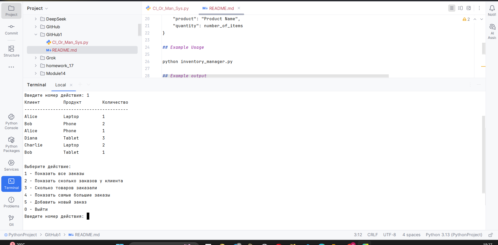

# Client Order Management System

This is a simple Python-based command-line system for managing customer orders. It allows users to view, analyze, and update orders made by clients for various products.

## Features

- **Display All Orders**: View the complete list of customer orders.
- **Client Order Count**: Find out how many orders a specific client has placed.
- **Product Quantities**: See the total quantity of each product ordered.
- **Top Clients**: Identify clients with the highest total number of items ordered.
- **Add New Orders**: Add a new order with customer name, product, and quantity.

## How It Works

The system uses a list of dictionaries, where each dictionary represents an order with the following fields:

```python
{
    "client": "Client Name",
    "product": "Product Name",
    "quantity": number_of_items
}
```

## Example Usage

To run the program, execute the following command in your terminal:

```bash
python inventory_manager.py
```

## Example Output

When you run the program, you can choose actions like:

```
1 - Display all orders  
2 - Show how many orders a client has placed  
3 - Show how many items of each product were ordered  
4 - Show clients with the highest number of total items ordered  
5 - Add a new order  
0 - Exit
```

## Screenshot of Program Output

*(Optional: add a screenshot in `assets/output_terminal.png`)*



## Author

Created by CraftSher
